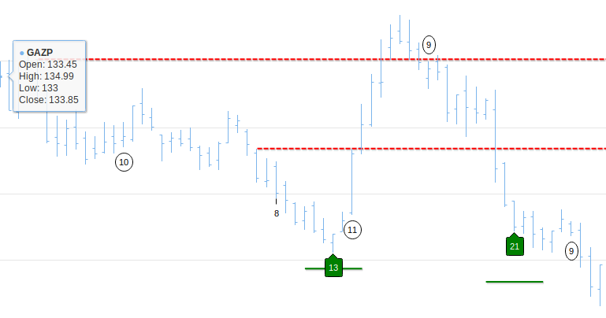
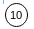
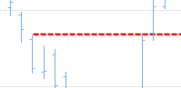
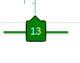
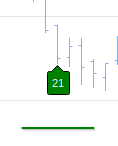
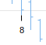

Typical sequenta setup:

Annotations explanation:

| Annotation | Description |
| ------------- |:-------------:| 
| | Setup annotation denotes trend with number in circle equals to number of bars in the initial trend thrust till pullback|
| | Tdst - is support/resistance formed once setup is reached|
| | Signal 13 is most powerful setup|
| | Signal 21 you can trade sporadically with other confirmations |
| | Signal cant happen without outreaching 8 countdown close|
